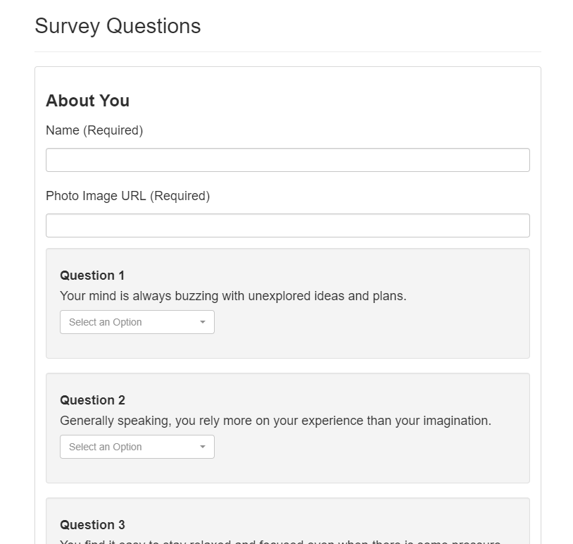

# FriendFinder

A friend finder app using Node and Express, that calculates compatibility based on users' survey answers.

## Prerequisites:
* Node.js

## Installation

* Download source code: `git clone https://github.com/jdwong415/FriendFinder.git`

* Install modules: `npm install`

## Usage

* Run server: `node server.js`

* Open in browser: `http://localhost:8080`

* Answer 10 survey questions 

* Find the friend that you've always been looking for.

## Demo
https://agile-island-75963.herokuapp.com/

